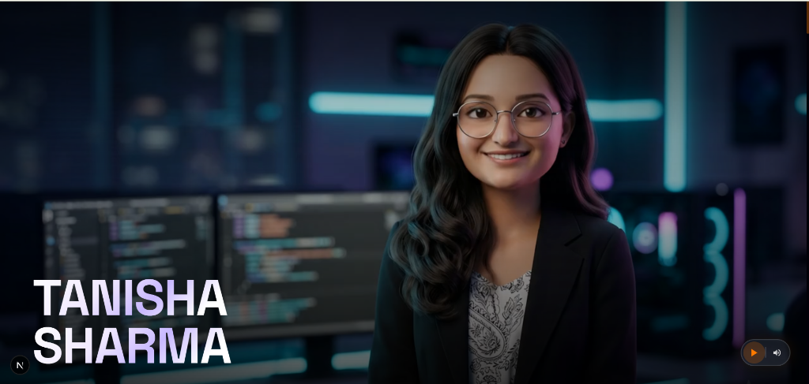

# Tanisha Sharma Portfolio



An immersive, production-ready cinematic creative web portfolio showcasing state-of-the-art interactive systems, real-time gesture-driven environments, and machine learning research projects.

---

## 🚀 Live Demo & Interactive Sandbox
Experience the live immersive components and creative labs directly on your browser.
* **GitHub Repository**: [Tanisha-Sharma-Portfolio](https://github.com/Tanisharma122/Tanisha-Sharma-Portfolio)
* **LinkedIn Profile**: [Tanisha Sharma on LinkedIn](https://www.linkedin.com/in/tanisha-sharma-81b329321/)
* **Email Inquiry Address**: [tanisharma0311@gmail.com](mailto:tanisharma0311@gmail.com)

---

## 🛠️ Advanced Technology Stack & Core Architectures

The entire project is engineered using a highly performant, modern frontend and graphics stack:

| Layer / Domain | Technologies & Libraries | Key Implementations & Mechanics |
| :--- | :--- | :--- |
| **Core Framework** | Next.js 16 (App Router), React, TypeScript | High-performance server-side rendering, type-safe structures, unified state management. |
| **3D Rendering Engine** | Three.js (WebGL), Custom Parametric Shaders | High-performance 3D vector fields, liquid-chrome beveled mesh rendering, interactive mouse/drag physics. |
| **Real-Time Hand Tracking** | MediaPipe Hands, MediaPipe Camera Utilities | 60FPS biometric skeleton tracking, coordinate LERP filters, custom gesture state classification. |
| **Kinetic Canvas & Writing** | HTML5 2D Canvas, Custom Path Interpolation | Particle-only writing brush, dual-pass glow masking with background color separation, responsive eraser tracking. |
| **Interactive Physics** | Custom Rigid-Body Physics Engine (Canvas) | Custom gravity, friction, restitution (bounce) factors, multi-body elastic collisions, mouse drag-force physics. |
| **Animation Systems** | GreenSock Animation Platform (GSAP), ScrollTrigger | Smooth scale transitions, spring-like elastic entrance loops, scroll-synchronized line tracks, mouse-reactive UI cards. |
| **Styling & Layout** | Pure CSS Modules (Vanilla), Modern Typographies | Strict CSS modules encapsulation, high-contrast dark themes, glassmorphism UI elements, fluid responsive grids. |

---

## 🏃 Local Setup & Development

Ensure you have [Node.js](https://nodejs.org/) installed on your system.

1. **Clone the Repository**:
   ```bash
   git clone https://github.com/Tanisharma122/Tanisha-Sharma-Portfolio.git
   cd Tanisha-Sharma-Portfolio
   ```

2. **Install Dependencies**:
   ```bash
   npm install
   ```

3. **Run Dev Environment**:
   ```bash
   npm run dev
   ```
   Open [http://localhost:3000](http://localhost:3000) on your browser.

4. **Compile Production Build**:
   ```bash
   npm run build
   ```

---

## 📂 Project Structure

```text
├── public/
│   ├── assets/             # Media assets & Resume resources
│   └── projects/           # Static images & portfolio assets
├── src/
│   └── app/
│       ├── components/
│       │   ├── AboutMe/
│       │   ├── CinematicLayer/
│       │   ├── ContactFinale/      # Contact Form & Physics Engine
│       │   ├── Experience/         # Career Timeline & 3D chrome arrow
│       │   ├── ExperimentalLabs/   # Creative Labs (Air Canvas & Three.js Galaxy)
│       │   ├── FluidDistortionCanvas/
│       │   ├── FluidSection/
│       │   ├── HeroOverlay/
│       │   ├── Milestones/
│       │   ├── ProjectsGrid/
│       │   ├── ProjectsStack/
│       │   ├── TechStack/
│       │   └── VideoIntro/
│       ├── globals.css
│       ├── layout.tsx              # Page Metadata & fonts
│       └── page.tsx                # Composition Entrypoint
├── package.json
└── tsconfig.json
```

## 🤝 Collaboration & Future Initiatives

I am an ambitious Computer Engineering student and research-oriented AI/ML developer deeply passionate about expanding into core engineering domains, advanced AI research initiatives, and autonomous robotics development.

If you are looking to collaborate, build innovative open-source systems, share ideas, or explore research proposals, feel free to reach out and connect! Let's combine our skills to pioneer the next generation of intelligent, interactive technology. ✨
